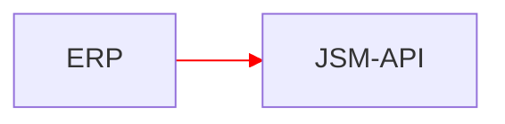
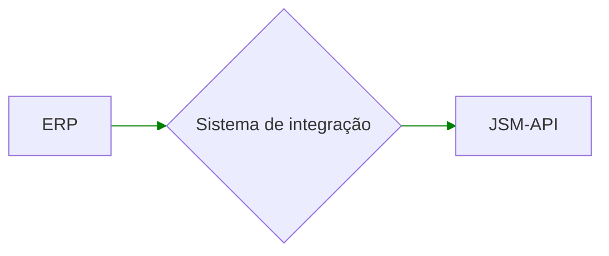

# Antes de começar

## Arquitetura

### Não utilizar

Não fazer a integração do seu ERP direto com as APIs da JSM:

Desvantagens:
- Precisarão expor as APIs do ERP publicamente na internet
- Qualquer deploy mau executado pode derrubar o ambiente de PRD
- Normalmente os ERPs tem tecnologias ultrapassadas
- Difícil utilizar tecnologias e arquiteturas novas
- Evolução da integração mais cara e difícil

### Sugerido

Crie uma camada entre os dois sistemas:

Vantagens:
- Não é necessário expor APIs do ERP publicamente na internet (muito importante para segurança)
- Integração pode ser evoluída sem alterar nada no ERP
- Novas bases de código podem usar tecnologias e arquitetura modernas
- Permite a criação de um buffer de pedidos, permitindo o processamento no tempo do ERP, que pode ser diferente do tempo das nossas APIs

## Cuidados para se tomar

### Volume de requisições

Por seguranca nossas APIs tem um limitador de volume de 3 requisições por segundo por endpoint. Se o volume de requisições passar desse limite, nossas APIs comecam a retornar HTTP Status 429 - Too Many Requests.

### Certificado

Nosso ambiente fica atrás dos serviços da Akamai que faz o uso de `virtual-hosting`. Para isso ele precisa que o client envie o `TLS SNI no ClientHello` (handshake inicial). Se não enviar, a Akamai não sabe qual certificado passar… e pode passar um certificado estranho, como o com domínio `a248.e.akamai.net`.  Passando o SNI, como `api-loja.juntossomosmais.com.br`, vai funcionar.

Isso acontece com tecnologia muito antigas, o que muitos ERPs e linguagens podem usar até hoje. [Neste link](https://community.akamai.com/customers/s/article/SNI-Server-Name-Indication?language=en_US) você pode ver as tecnologias que já suportam o SNI.

Qualquer linguagem mais atual já suporta. Um simples `curl` já tem esse suporte desde 2009, logo você não deve ter problemas caso esteja usando tecnologias com até 10 anos.
