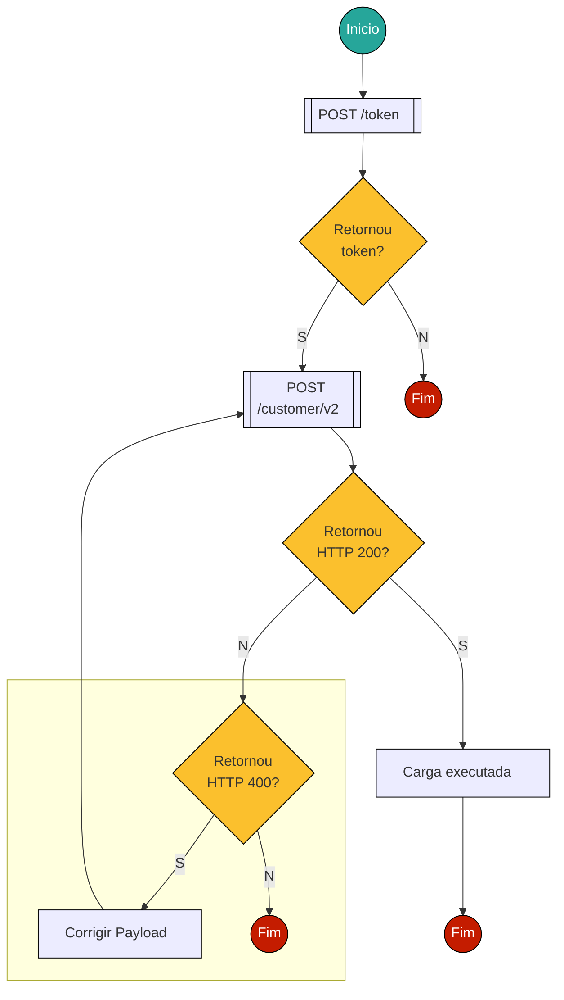
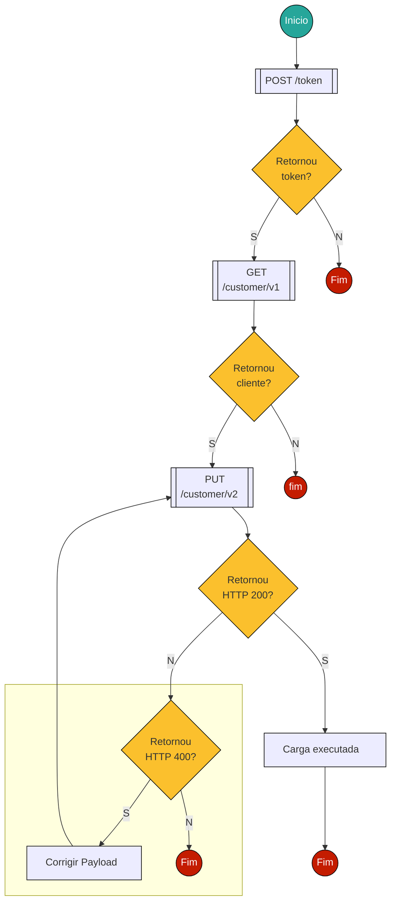
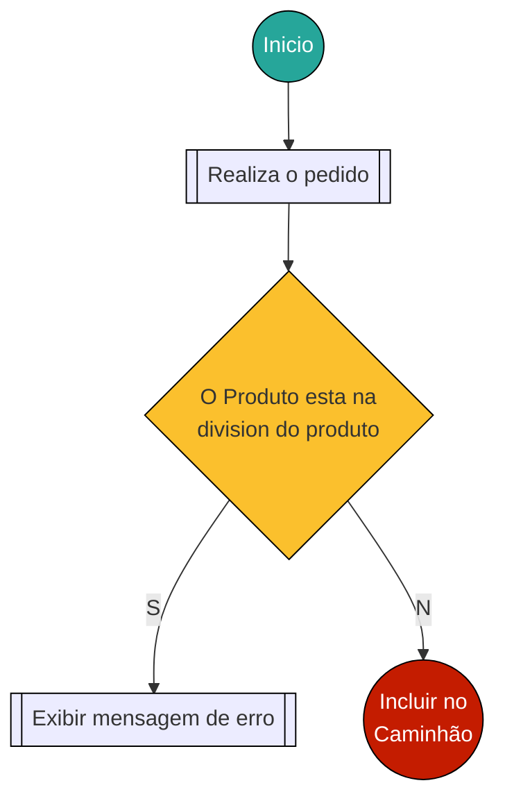

# Configuração de clientes

## Fluxos de cadastro e alteração de clientes
As configurações de clientes devem ser feitas ou no cadastro usando o **endpoint** [POST v2/customer](https://hml-api-loja.juntossomosmais.com.br/customer/documentation/index.html#operation/PostAddCustomerAsync) ou alterando o cliente utilizando o **endpoint** [PUT v2/customer](https://hml-api-loja.juntossomosmais.com.br/customer/documentation/index.html#operation/PutUpdateCustomer).
### Fluxo de cadastro de cliente




### Fluxo de alteração de cliente


<tip-component message="Clique no nome da rota para ser direcionado para a documentação da API."></tip-component>
## Configuração de formas e condições de pagamento

Essa configuração pode ser feita tanto no momento do [cadastro](#Fluxo-de-cadastro-de-cliente) do cliente ou no [pós cadastro](#Fluxo-de-alteração-de-cliente) alterando um cliente, mas sempre respeitando as [formas e condições de pagamentos](../businessRules/formas-pagamento) pré-estabelecidas.

### Configuração de condição e formas de pagamento para um cliente novo

A propriedade responsável pela configuração é a `paymentConditions` e `paymentForms`, que significam condição de pagamento e forma de pagamento respetivamente.

#### cenários de exemplo 

**Cenário 1**: Adicionar **Boleto á Vista** para um cliente.

```json
{
    "paymentForms": [
      {

        "codePayment": "B",
        "descriptionPayment": "Boleto",
      }
	],
	"paymentConditions":[
        {
        "codePayment": "B",
        "codePaymentTerm": "B001",
        "descriptionPaymentTerm": "Á vista",
   	   }
    ]
}
```

**cenário 2**: Adicionar **Boleto á Vista** e **Cartão de Crédito até 10X** para um cliente.

```json
{
    "paymentForms": [
      {

        "codePayment": "B",
        "descriptionPayment": "Boleto",
      },
      {

        "codePayment": "Q",
        "descriptionPayment": "Cartão de Crédito",
      },
	],
	"paymentConditions":[
        {
        "codePayment": "B",
        "codePaymentTerm": "B001",
        "descriptionPaymentTerm": "Á vista",
   	   },
        {
        "codePayment": "Q",
        "codePaymentTerm": "ZC50",
        "descriptionPaymentTerm": "Cartão de Crédito até 10x",
   	   }
    ]
}
```
<tip-component message="Os cenários são validos tanto para o cadastro como para alteração de um cliente"></tip-component>

## Configuração do Sales Area

O `SalesArea` serve como um restritivo para venda ele possui a configuração `Division` que deve ser a mesma cadastrada para o produto  e caso o cliente não possua uma compatibilidade com o produto, que é verificado no parâmetro `Division`, não será possível incluir o produto no carrinho e será exibida uma mensagem de erro.




Para que o erro não ocorra a propriedades `division` do cliente e o `sector` dos produtos devam ser fixadas como **01**

### Detalhes importantes: 

- No cadastro do cliente, a configuração de **CIF** é automática, ou seja, não é necessário informar um `SalesArea` do tipo **CIF**.

- Para que o cliente tenha **FOB** habilitado, é necessário um **registro** com `Incoterm` do tipo **FOB** na lista de `SalesArea`  do cadastro de clientes.
  Exemplo: 

    ```json
  
  "salesAreas": [
        {
  			 "Organization" : "OFFL",
              "OrganizationName" : "Offln",
              "DistributionChannel" : "0",
              "DistributionChannelName" : "Venda Direta",
              "Division" : "01",
              "DivisionName" : "General",
              "CustomerGroup" : "01",
              "Incoterm" : "CIF",
              "SalesOffice" : "0001",
        },
        {
  			"Organization" : "OFFL",
              "OrganizationName" : "Offln",
              "DistributionChannel" : "0",
              "DistributionChannelName" : "Venda Direta",
              "Division" : "01",
              "DivisionName" : "General",
              "CustomerGroup" : "01",
              "Incoterm" : "FOB",
              "SalesOffice" : "0001",
        }
      ]
    ```
## Configuração de parâmetros do cliente
Os parâmetros dos clientes podem ser utilizados para criar clientes, regra de exibição de produtos, regra de restrição de produtos e para exibição de preço, sendo que para cadastrar um parâmetro para o cliente é necessário que esse parâmetro esteja cadastrado também nos [parâmetros da Industria](./cadastro-de-seller).

A propriedade responsável pelos parâmetros é o `Paramenters`como pode ser visto no exemplo a baixo:

```json
    "Parameters":[
        {
            "Status" : 1,
            "Description" : "Brasil",
            "Code" : "Pais",
            "Value" : "BR",
            "ParameterId" : "90212744-c444-4c0b-94d8-08d700087c78"

        }
    ]
```

> O campo `ParameterId` é o **Id** do parâmetro cadastrado para a Industria.

---
**Dicionário de termos:**
- **Incoterm**: Método de entrega
- **CIF**: Entrega
- **FOB**: Retira
- **SalesArea**: Area de venda