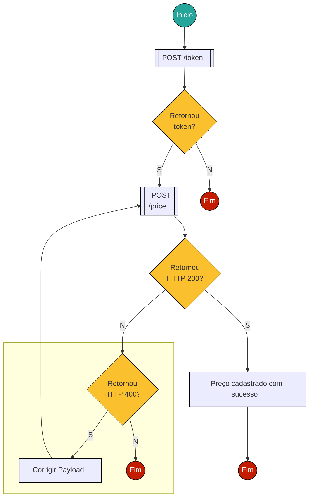

# Configuração de preços

## Fluxo de cadastro de preço 
O cadastro de preço para um produto deve ser realizado através do **endpoint - POST /price** que se encontra na aba **Price** em  [Gerenciamento cadastro de Produtos](https://juntossomosmais.github.io/fortress-of-solitude/guide/apiDocs/apis-expostas.html#gerenciamento-cadastro-de-produtos)

::: warning Atenção
-  Sempre que cadastrar um preço os valores anteriores serão sobrescritos.
:::

 

## Configuração do Preço Padrão
O Preço Padrão de um produto é definido associando um valor (R$) à um produto e um estado (UF). Outras variações de composição de preço padrão podem ser exploradas através da aplicação de parâmetros. 

### Preço Padrão do Produto

- Um preço padrão é definido como no exemplo abaixo.

| Código do Material | Produto | UF | Preço Padrão | 
| :----:  | :----: | :----: | :----: |
|20022663|BUCHA DE REDUÇÃO ROSCÁVEL |SP|R$ 10.00|
|20022663|BUCHA DE REDUÇÃO ROSCÁVEL |RJ|R$ 12.00|

### Parametrização do Preço Padrão 

- O Preço padrão pode variar de acordo com a aplicação de parâmetros para definir preços personalizados para determinados grupos de clientes.

| Código do Material | Produto | UF |Parâmetro | Preço Padrão | 
| :----:  | :----: | :----: | :----: | :----: |
|20022663|BUCHA DE REDUÇÃO ROSCÁVEL |   -   |SP|R$ 10.00|
|20022663|BUCHA DE REDUÇÃO ROSCÁVEL |Bronze |SP|R$ 9.00|
|20022663|BUCHA DE REDUÇÃO ROSCÁVEL | Prata |SP|R$ 8.00|
|20022663|BUCHA DE REDUÇÃO ROSCÁVEL | Ouro  |SP|R$ 7.00|

::: warning Atenção
 - Caso haja a aplicação de mais de um parâmetro na formação de preço padrão do cliente, a combinação que resulte no menor valor será a considerada.
:::

### Variação de Preço Por Parâmetros.

- Uma vez definido os parâmetros e suas variações de preço, o cálculo para a precificação final se dará da seguinte forma:

|CNPJ|País (Parâmetro 1)|Classificação (Parâmetro 2)|Variação de Preço|Valor do Produto| Valor Final|
|:--- |:----:|:----:|:----:|:----:|:----:|
|94.279.817/0001-94|Br|Ouro  |-20%|R$ 10.00|R$ 8.00|
|92.085.703/0001-88|Br|Prata |-10%|R$ 10.00|R$ 9.00|
|50.230.990/0001-22|Br|Bronze|-5% |R$ 10.00|R$ 9.50|
|53.220.980/0001-25|Br| -    |0%  |R$ 10.00|R$ 10.00|

::: tip Dica
- Nas **regras de negócio** você poderá encontrar informações com mais detalhes sobre [variação de preço](https://juntossomosmais.github.io/fortress-of-solitude/guide/businessRules/price-variation.html#modelo-de-variacao-de-preco)
:::